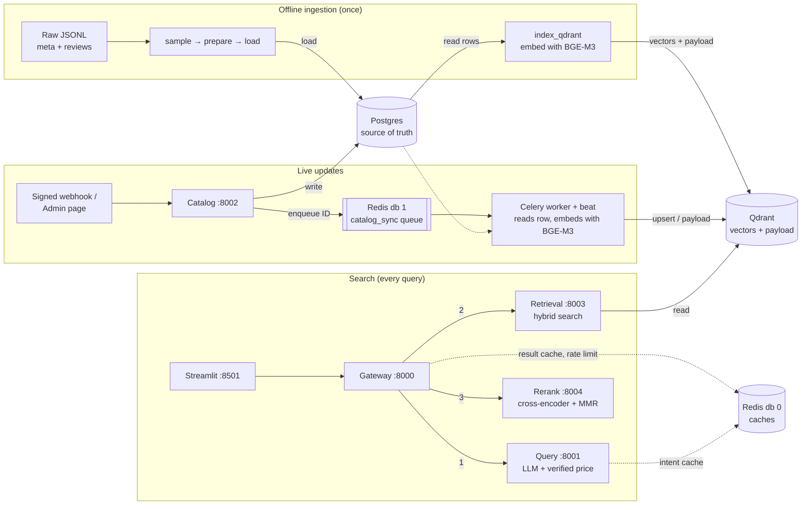

# Project Report: FashionRec

**Multilingual semantic fashion search with a live catalogue**
Prodapt hiring hackathon · Repository: https://github.com/Sankar2603/FashionProdapt

---

## 1. Overview

Shoppers describe what they want in their own words and language: *"camisa de lino para el verano por menos de $40"*. Keyword search fails on such queries, and catalogues change constantly. FashionRec solves both:

- **Understands** a free-text request in any language, including its budget.
- **Finds** the five most relevant, affordable, well-rated products among **45,993** Amazon Fashion products.
- **Stays current:** a price change, new product or removal is searchable about a second after it happens.

| Result | Value |
| --- | --- |
| Price accuracy (36 multilingual test queries) | 100% |
| Intent quality | 100% |
| nDCG@5, retrieval → after rerank | 0.643 → 0.713 |
| Recall@20 (retrieval) | 0.690 |
| Webhook → searchable | ~0.1–1 s |



**Core rule:** writes go to Postgres, Qdrant is built from Postgres, and searches read only Qdrant.

---

## 2. Tech stack at a glance

| Layer | Technology | Version | Role |
| --- | --- | --- | --- |
| Language | Python | 3.11 (images) | All services and scripts |
| API services | FastAPI + Uvicorn | 0.142 / 0.54 | Five HTTP microservices |
| HTTP client | httpx | 0.28 | Async service-to-service calls |
| Validation | Pydantic | 2.x | Request/response and data schemas |
| Database | PostgreSQL + SQLAlchemy + psycopg | 16 / 2.0 / 3.2 | Source of truth |
| Vector database | Qdrant + qdrant-client | 1.19 | Hybrid vector search + payload |
| Cache / queue | Redis | 7.4 | Caches, rate limits, job queue, locks |
| Background jobs | Celery | 5.6 | Sync worker + scheduled reconciliation |
| Embeddings | BGE-M3 via FlagEmbedding | 1.4 | Dense + sparse vectors |
| Reranker | bge-reranker-v2-m3 via transformers | 5.18 | Cross-encoder relevance |
| LLM | `openai/gpt-oss-120b` on Groq | — | Query understanding |
| LLM framework | LangChain (core, groq, ollama) | 1.6 | Structured output |
| Frontend | Streamlit | 1.65 | Search, admin, system pages |
| Infrastructure | Docker + Docker Compose | — | 11 containers, one network |

---

## 3. Tech stack in depth

### 3.1 Storage

**PostgreSQL 16 (source of truth).** Holds the `products` table (19 columns: descriptive fields, price, ratings, `bayesian_score`, `search_text`, `content_hash`, `is_deleted`, timestamps) and `webhook_events` (one row per accepted webhook). Accessed through **SQLAlchemy 2.0 ORM** models shared by every component.
*Why:* live updates need indexed single-row writes, row locks for concurrent webhooks, transactions, constraints, and conditional "only if newer" upserts. A JSON file offers none of these.

**Qdrant 1.19 (search index).** One point per product with two named vectors (`dense`: 1,024 floats, cosine; `sparse`: token weights) and a payload with everything search needs (title, price, image, ratings, `search_text`, `content_hash`, `is_deleted`). Payload indexes on `price` and `is_deleted` make filters fast. Services query the alias `fashion_items_active`, never a collection name.
*Why:* dense search, sparse search, RRF fusion and filters run in **one query**; aliases give zero-downtime reindexing. *Considered:* FAISS (a library, no filtering or live updates), pgvector (hybrid fusion would be hand-written).

**Redis 7.4 (four jobs, two databases).**

| db | Key | Purpose |
| --- | --- | --- |
| 0 | `intent:v2:<md5>` | Parsed-query cache (24 h) |
| 0 | `search:<version>:<md5>:<top_n>` + `catalog:version` | Search-result cache, invalidated by catalogue changes |
| 0 | `ratelimit:<ip>:<minute>` | 30 searches/min per client |
| 1 | `catalog_sync`, `lock:sync:<asin>` | Celery queue and per-product locks |

### 3.2 AI models

**BGE-M3 (embeddings).** A multilingual retrieval model (XLM-RoBERTa-large, ~568M parameters, 100+ languages). From one pass over a product's `search_text` (up to 512 tokens) it produces:
- a **dense vector** (1,024 numbers): overall meaning, so "breezy top" lands near "lightweight blouse";
- **sparse weights**: important words with scores, so exact brands like "Levi's 501" match.

The same model embeds products (offline and in the worker) and queries (Retrieval Service), so both share one vector space. *Considered:* multilingual-e5 (dense only), OpenAI embeddings (API cost, latency, data leaves the system).

**bge-reranker-v2-m3 (cross-encoder).** Reads the query and a product's text **together** (`<s> query </s></s> product text </s>`, max 256 tokens) and outputs one relevance score (sigmoid, 0–1). Far more precise than comparing separate vectors, so it reorders retrieval's top 20. Called directly with Hugging Face **transformers** (identical scores to FlagEmbedding's wrapper, with less overhead). *Considered:* MiniLM cross-encoder (English-only), Cohere Rerank (API dependency).

**gpt-oss-120b on Groq (query understanding).** One structured-output call returns `{search_query (English), language, max_price, currency}`, with `temperature=0`, `reasoning_effort=low`, an 8 s timeout and one retry. Groq's inference keeps the median at ~0.7 s. *Considered:* Llama 3.3 70B (not available on our Groq plan), Qwen3, a local Ollama model (kept as a config switch: `LLM_PROVIDER=ollama`).

**LangChain (only for structured output).** `ChatGroq(...).with_structured_output(LLMIntent)` turns a Pydantic model into the schema the LLM must fill and validates the reply. Isolated in one file (`query_service/app/llm.py`); no chains or agents. *Considered:* Instructor or the plain OpenAI-compatible SDK, either a one-file swap.

### 3.3 Services

**FastAPI + Uvicorn.** Five services (gateway 8000, query 8001, catalog 8002, retrieval 8003, rerank 8004). All are built with one shared factory, `create_app()`, which adds:
- correlation-ID middleware (a contextvar, forwarded on every call);
- JSON logging;
- a single error format: `{"error": {code, message, correlation_id, details}}`;
- `GET /health`.

Models load once in the `lifespan` hook and are **warmed up** before traffic arrives. Blocking model and database calls run in `run_in_threadpool` so the event loop stays responsive.

**httpx.** One shared async client in the gateway (connection reuse), with a per-step timeout and the correlation-ID header on every call.

**Pydantic.** Validates every request and response, the LLM's output (`LLMIntent`), webhook events, and every product record (`ProductRecord`: price > 0, rating 0–5, 64-character hash, and so on), in both batch ingestion and the live webhook path.

### 3.4 Background processing

**Celery 5.6 with a Redis broker.** The Catalog Service sends `worker.sync_product(parent_asin)` by name, and the worker runs it.

| Setting | Why |
| --- | --- |
| `--pool=solo`, prefetch 1 | Model loaded once; one job at a time |
| `acks_late` + `reject_on_worker_lost` | A crash returns the job to the queue instead of losing it |
| Auto-retry with exponential backoff (up to 8) | Survives brief Qdrant, Postgres or Redis outages |
| Per-product Redis lock | Safe with several workers |
| **Celery beat** | Reconciliation every 5 min (recent changes) and 6 h (everything) |

*Considered:* RQ (no built-in scheduling), Kafka (far more infrastructure than this event volume needs).

### 3.5 Infrastructure

**Docker Compose** runs 11 containers on one network, where services reach each other by name (`http://qdrant:6333`). Every port is bound to `127.0.0.1`. Images use `python:3.11-slim`, CPU-only PyTorch wheels (several GB smaller than the default CUDA build), a non-root user, and the shared library installed from `libs/common`. The model cache is mounted from the host (`HF_CACHE_DIR`) or kept in a named volume, so models download once. `docker-compose.gpu.yml` switches the reranker to CUDA. Health checks control start-up order.

### 3.6 Frontend

**Streamlit** with three pages:
- **Search:** intent line, product grid, latency chart, fallback banner.
- **Admin:** look up, reprice, edit, delete, restore or create products through signed webhooks.
- **System:** service health and queue length.

It runs server-side, so the webhook secret never reaches the browser. All backend calls live in one module (`frontend/api.py`). *Considered:* React (more polish, but 3–4× the work, plus a proxy for signing).

---

## 4. Data pipeline

| Step | Script | What it does |
| --- | --- | --- |
| 1 | `ingestion/sample.py` | Streams the raw meta file; keeps valid JSON objects with an ID, title and valid price, removes duplicates and kids' items; keeps only reviews of kept products |
| 2 | `ingestion/prepare.py` | Cleans text (HTML entities, tags, whitespace); joins lists; picks one image; joins review counts; computes the Bayesian score, `search_text` and `content_hash`; validates each record with Pydantic |
| 3 | `ingestion/load_postgres.py` | Creates tables; batched `INSERT … ON CONFLICT DO UPDATE` (safe to re-run) |
| 4 | `ingestion/index_qdrant.py` | Reads active rows **from Postgres**, embeds `search_text` in batches, upserts points, sets the alias |

**Bayesian score**, with R = average rating, v = number of ratings, C = catalogue mean, m = 20:

```
bayesian_score = v/(v+m) · R + m/(v+m) · C
```

A product with one 5★ rating is pulled toward the catalogue mean; one with thousands keeps its own average.

**`search_text`** is `Title / Category / Brand / Features / Description`, with no price or ratings. **`content_hash`** is its SHA-256 fingerprint. A price change therefore never changes the hash, so it never triggers re-embedding.

---

## 5. Search flow

Example: `camisa de lino para el verano por menos de $40`

1. **Gateway:** validates the request, applies the rate limit, then checks the result cache. Cache key = query + `top_n` + catalogue version.
2. **Query Service:**
   - **Price:** a regex runs first and finds `$40`. Had it found nothing, the LLM's proposed price would be accepted only if that number appears in the query and its currency is known, then converted to USD in code.
   - **LLM:** returns `linen summer shirt`, language `es`.
   - **Fallback:** if the LLM fails, rules answer instead.
3. **Retrieval:** BGE-M3 embeds the phrase. Qdrant runs dense and sparse prefetches (50 each), both filtered by `price ≤ 40` and `is_deleted = false` **inside** the search, fuses them with **Reciprocal Rank Fusion**, and returns the top 20 with payloads and dense vectors.
4. **Rerank:**
   - The cross-encoder scores each of the 20.
   - `final = relevance + 0.1 × normalised Bayesian score`.
   - **MMR** (λ = 0.7) picks 5 that are relevant but not near-duplicates, using the dense vectors.
5. **Gateway:** returns the intent, products, `degraded` list and per-step latency; stores the result in the cache.

| If this fails | The user gets |
| --- | --- |
| LLM | Rule-parsed search (`source: rules`) |
| Query Service | Gateway parses with the same shared rules |
| Rerank | Retrieval order (`rerank_skipped`) |
| Retrieval / Qdrant | 503 |
| Redis | No caching or rate limiting; search still works |

---

## 6. Live catalogue updates

1. **Webhook → Catalog Service:**
   - The HMAC-SHA256 signature over `timestamp.body` is checked, and the timestamp must be within 5 minutes.
   - The event is validated with Pydantic.
   - The product is rebuilt with the same rules as ingestion.
2. **One transaction:**
   - Insert the `event_id` (already present means `duplicate`).
   - Lock the row.
   - Upsert only if the event's `occurred_at` is newer than the stored `source_updated_at` (otherwise `stale`).
3. **Queue** a job carrying only the product ID, then reply **202**.
4. **Worker:** reads the **current** Postgres row and Qdrant point and picks the cheapest correct action:

| Situation | Action | Embeds? |
| --- | --- | --- |
| New product | `index` | yes |
| Text changed (hash differs) | `reembed` | yes |
| Price / rating changed | `payload` | no |
| Deleted | `delete` (marks `is_deleted`) | no |
| Already in sync | `noop` | no |

5. The worker then bumps the **catalogue version**, so cached search results refresh.
6. **Reconciliation** (beat) compares Postgres with Qdrant in batches of 500 and queues fixes for any drift.

---

## 7. Key design decisions

| Decision | Why |
| --- | --- |
| Postgres as truth, Qdrant derived | Safe live writes; the index can always be rebuilt |
| Search reads only Qdrant | No database on the hot path |
| LLM proposes the budget, code verifies it | Any language, but the price is a hard filter, so it must be exact |
| Hybrid search + RRF | Meaning and exact words; ranks are comparable where raw scores aren't |
| Filter inside the vector search | Every candidate already fits the budget |
| Bi-encoder → cross-encoder | Fast recall, then precise ordering of 20 |
| Hash excludes price and ratings | Price changes are payload-only updates |
| Idempotency + source-time ordering | Retries and late events are harmless |
| Jobs carry only an ID; reconciliation | Duplicate or reordered jobs converge; drift is repaired |
| Version-keyed result cache | Instant repeats, never a stale price |
| Fixed pipeline, not an agent | Predictable, testable, no LLM calls spent on orchestration |

---

## 8. Limitations and next steps

| Limitation | Next step |
| --- | --- |
| Reranking on CPU takes ~8.4 s per search | GPU build (<1 s) or an ONNX int8 reranker |
| Only priced products are indexed; rare types can be missing (e.g. sarees) | More catalogue sources and categories |
| Budget verification needs digits; currency rates are fixed | A multilingual number parser and live exchange rates |
| No outfit assembly for occasion queries | Outfit construction on top of search |
| 36 author-written queries, LLM judge | A larger multilingual set (32 more queries ready) and independent labels |

---

## Appendix: repository structure

```
├── docker-compose.yml / docker-compose.gpu.yml / .env.example
├── ingestion/        sample · prepare · load_postgres · index_qdrant
├── libs/common/fashion_common/
│                     models, schemas, catalog rules, embedder, vector store,
│                     webhooks, query rules, logging, errors, service app factory
├── services/         gateway · query_service · retrieval_service · rerank_service
│                     · catalog_service · worker
├── frontend/         Streamlit app + pages + api.py
├── eval/             queries, run_eval, confidence, results
└── scripts/          search.ps1 · send_webhook.py · switch_alias.py · check-infra.py
```

Setup, configuration and API details are in the [README](../README.md).

---

## 9. Evaluation

**Method.** 36 hand-written multilingual queries: English, Spanish, Hindi, French, German, Portuguese and Italian, with budgets written as symbols, digits and words, brands, a typo, a vague request and a prompt injection. They run end to end against the live services. An LLM judge (strict 0/1/2 rubric, structured output) labels every product in a pool drawn from hybrid, dense-only and sparse-only results; a balanced sample is checked by hand.

| Metric | What it measures | Result |
| --- | --- | --- |
| Price accuracy | Budget extracted exactly | 100% (36/36) |
| Intent quality | Key words kept, language right, no price leak | 100% (36/36) |
| **nDCG@5** | Are the best products at the top of the 5 shown? Graded and position-aware | 0.643 → **0.713** after rerank |
| Recall@20 | Did retrieval keep the relevant products for the reranker? | 0.690 |
| Latency p50 / p95 | Full search on CPU | 8.7 s / 9.6 s (rerank ~8.4 s) |

**Why these metrics.** nDCG@5 rewards relevant items, rewards exact matches more than partial ones, and rewards putting them first, which is what a shopper scanning five results experiences. Precision@5 ignores order and grades, and MRR only looks at the first hit. Recall@20 judges the retrieval stage, whose job is not to lose good candidates. A bootstrap over the per-query differences confirms the rerank lift is positive.

**Reproduce:** `python -m eval.run_eval`, then `python -m eval.confidence`.