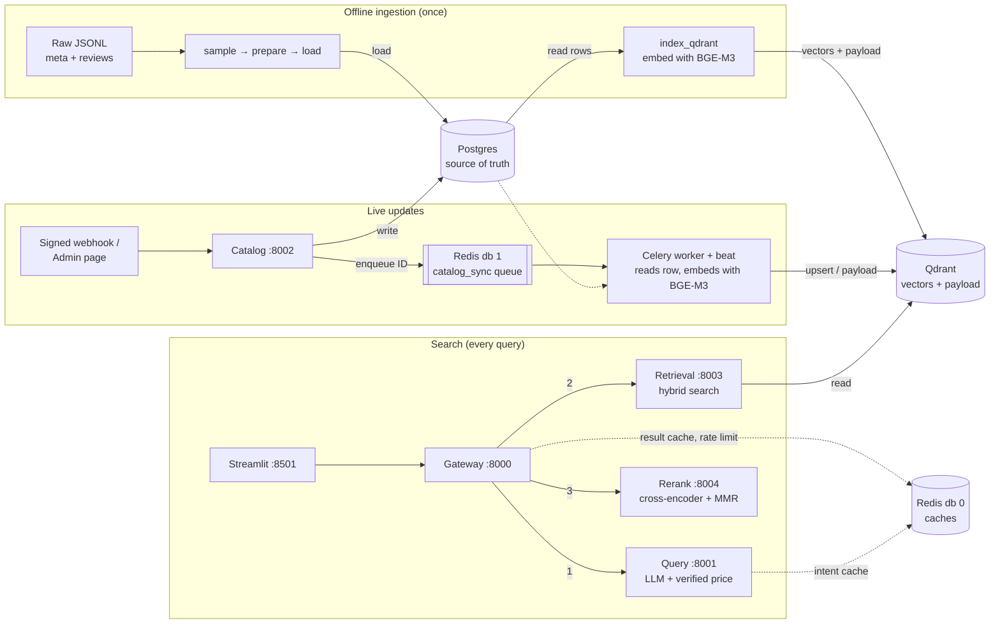

# FashionRec: multilingual semantic fashion search with a live catalogue

FashionRec is a **multilingual** semantic fashion search: it turns a shopper's free-text request, in the shopper's own language, into the five most relevant, affordable and well-rated products from the [Amazon Reviews 2023 "Amazon Fashion"](https://amazon-reviews-2023.github.io/) catalogue, and keeps those results current as products are added, repriced or removed. It indexes **45,993 products**: every product in the Amazon Fashion file with a valid price, with kids' items excluded.

Built for the Prodapt hiring hackathon as a set of Dockerised microservices.

```
"camisa de lino para el verano por menos de $40"
   → intent: "linen summer shirt", max price $40, language es
   → 5 linen shirts under $40, best-rated first, no near-duplicates
```

## Highlights

- **Multilingual query understanding:** an LLM (Groq `gpt-oss-120b`) detects the shopper's language and rewrites the query into an English product phrase; the multilingual BGE-M3 embeddings and cross-encoder add a second layer of language coverage. Budgets are understood in any language ("moins de 40 dollars", "500 रुपये से कम") but **code owns the numbers**: a regex runs first, and an LLM-proposed price is accepted only if that number literally appears in the query, then converted to USD by code.
- **Two-stage search:** hybrid retrieval (BGE-M3 dense + sparse vectors, fused with RRF in Qdrant) finds 20 candidates; a cross-encoder (`bge-reranker-v2-m3`) reorders them, a Bayesian rating breaks near-ties, and MMR keeps the top 5 varied.
- **Evolving catalogue:** signed webhooks update Postgres; a Celery worker syncs Qdrant within about a second, re-embedding only when a product's text changed.
- **Production habits:** per-step timeouts with graceful fallbacks, idempotent and order-safe webhooks, retries with backoff, scheduled reconciliation, a cache that is invalidated by catalogue changes, correlation IDs across every service, JSON logs and health checks.
- **Measured:** an evaluation suite with an LLM judge, nDCG@5, Recall@20 and a bootstrap confidence interval.

## Architecture



**The rule behind it:** writes go to Postgres, Qdrant is built from Postgres, and searches read only Qdrant.

| Component | Port | Role |
| --- | --- | --- |
| `frontend` | 8501 | Streamlit UI: search, catalogue admin, system status |
| `gateway` | 8000 | Public API; rate limit; result cache; fixed pipeline query → retrieval → rerank with fallbacks |
| `query` | 8001 | LLM intent parsing (LangChain structured output) + verified multilingual price extraction + Redis cache |
| `catalog` | 8002 | Signed webhooks → validated Postgres writes → sync jobs |
| `retrieval` | 8003 | BGE-M3 query embedding + filtered hybrid search in Qdrant |
| `rerank` | 8004 | Cross-encoder relevance, Bayesian rating nudge, MMR diversity |
| `worker` / `beat` | — | Celery: sync Postgres → Qdrant; reconcile every 5 min and 6 h |
| `postgres` | 5432 | Catalogue (`products`) and webhook log (`webhook_events`) |
| `qdrant` | 6333 | Collection `fashion_items_v1` behind the alias `fashion_items_active` |
| `redis` | 6379 | db 0: intent cache, result cache, rate limits · db 1: Celery queue, sync locks |

All ports are bound to `127.0.0.1`.

## How a search works

1. **Gateway** assigns a correlation ID, validates the request, applies the rate limit, and checks the result cache. The cache key includes a catalogue version, so a cached result is never older than the last catalogue change.
2. **Query Service** asks the LLM, in one structured-output call, for an English search phrase, the language, and any upper budget with its currency. The budget is decided by code:
   - a **regex** runs first and always wins when it finds a price (`$40`, "under 40 dollars", "por menos de", "से कम");
   - otherwise the **LLM's proposed price** is accepted only if the number literally appears in the query and the currency is known; it is then converted to USD with a fixed rate table;
   - if neither yields a verified price, **no price filter** is applied (showing more is safer than wrongly hiding products).

   If the LLM fails, a rule-based parser answers instead (regex price + the user's own words). Intents are cached for 24 h.
3. **Retrieval** embeds the phrase with BGE-M3 and runs one Qdrant query: dense and sparse searches, both filtered by price and `is_deleted` *inside* the search, fused with Reciprocal Rank Fusion → 20 candidates.
4. **Rerank** scores each query–product pair with a cross-encoder (0–1), adds up to +0.1 for a trusted rating, then picks 5 with MMR (λ = 0.7) to avoid near-duplicates.
5. **Gateway** returns the intent, products, any fallbacks used (`degraded`) and a per-step latency breakdown.

If a stage fails, the search still answers where possible: the Query Service falling back to rules, or rerank being skipped, is reported in `degraded`; only a retrieval failure returns 503.

## How live updates work

1. A signed webhook (`product.upserted` / `product.deleted`, full product snapshot) reaches the Catalog Service. The HMAC-SHA256 signature and a 5-minute timestamp window are checked.
2. In **one Postgres transaction**: the `event_id` is recorded (a retried delivery is a `duplicate`), the product row is locked, and the upsert applies only if the event is newer than the last one applied (`stale` otherwise).
3. A small job (`worker.sync_product(parent_asin)`) is queued in Redis. The service replies `202` in milliseconds.
4. The worker reads the **current** row and the Qdrant point and does the cheapest correct action: `index` / `reembed` (BGE-M3) when the content hash changed, `payload` for price or rating changes (no embedding), `delete`, or nothing. Then it bumps the catalogue version, invalidating cached search results.
5. Beat-scheduled reconciliation compares Postgres with Qdrant and repairs any drift (missed jobs, a queue outage, manual edits).

## Quick start

### Prerequisites
- Docker Desktop (allocate ~12 GB RAM; models run on CPU in containers)
- Python 3.11+ (for the ingestion scripts)
- A [Groq API key](https://console.groq.com/)
- The two dataset files in the project root: `meta_Amazon_Fashion.jsonl` and `Amazon_Fashion.jsonl`
- Optional: an NVIDIA GPU makes indexing much faster

### 1. Set up
```powershell
git clone https://github.com/Sankar2603/FashionProdapt.git
cd FashionProdapt
python -m venv venv
.\venv\Scripts\Activate.ps1
pip install -r requirements.txt
Copy-Item .env.example .env
```
Edit `.env`: set `POSTGRES_PASSWORD` (and the same password inside `DATABASE_URL`), `GROQ_API_KEY`, and `WEBHOOK_SECRET`:
```powershell
python -c "import secrets; print(secrets.token_hex(32))"
```

### 2. Start the data stores
```powershell
docker compose up -d redis qdrant postgres
python scripts/check-infra.py
```

### 3. Ingest the catalogue
```powershell
python -m ingestion.sample --max-items 0   # full catalogue (~46k products); --max-items 5000 for a quick trial
python -m ingestion.prepare                # clean, enrich, validate
python -m ingestion.load_postgres          # into Postgres
python -m ingestion.index_qdrant           # embed with BGE-M3, build Qdrant, set the alias
```
The first indexing run downloads BGE-M3 (~2.3 GB). Set `EMBEDDING_DEVICE=cuda` in `.env` to index on a GPU.

### 4. Start every service
```powershell
docker compose up -d --build
docker compose ps
```
Wait until the services show `healthy`. Retrieval and rerank load and warm up their models first (a few minutes on the first start, which also downloads the reranker).

### 5. Use it
- **UI:** http://127.0.0.1:8501
- **API:**
  ```powershell
  .\scripts\search.ps1 'camisa de lino para el verano por menos de $40'
  ```
- **Live update:**
  ```powershell
  python scripts\send_webhook.py price <ASIN> 9.99
  .\scripts\search.ps1 'camisa de lino para el verano por menos de $40'
  ```
  Also available: `show`, `edit --title ...`, `new --title ... --price ...`, `delete`, plus `--repeat 2` (duplicate), `--age-seconds 3600` (stale), `--bad-signature` (401).
- **Reconcile now:** `docker compose exec worker python -m app.run_reconcile`
- **Trace one request:** `docker compose logs | Select-String <correlation_id>`

## API

**`POST http://127.0.0.1:8000/search`**
```json
{"query": "linen shirt under $40", "top_n": 5}
```
Response (abridged):
```json
{
  "correlation_id": "903560cf...",
  "intent": {"search_query": "linen shirt", "max_price": 40.0, "language": "en", "source": "llm"},
  "count": 5,
  "results": [{"parent_asin": "B08Y8QVR7R", "title": "...", "store": "...", "price": 15.0,
               "average_rating": "...", "rating_number": "...", "image_url": "...", "relevance": 0.876}],
  "degraded": [],
  "latency_ms": {"query_parse_ms": "...", "retrieval_ms": "...", "rerank_ms": "...", "total_ms": "..."},
  "cached": false
}
```
Every service exposes `GET /health`. Errors share one shape: `{"error": {"code", "message", "correlation_id", "details"}}`.

**`POST http://127.0.0.1:8002/webhooks/products`** (signed; see `scripts/send_webhook.py` and `libs/common/fashion_common/webhooks.py`) · **`GET http://127.0.0.1:8002/products/{parent_asin}`**

## Evaluation

36 hand-written multilingual test queries (English, Spanish, Hindi, French, German, Portuguese and Italian; budgets written as symbols, numbers and words, including a rupee budget converted to USD; brands; a typo; a vague request; a prompt-injection attempt), run end to end against the live services.

- **Relevance labels:** an LLM judge (`gpt-oss-120b`, strict 0/1/2 rubric, structured output) labels every product in a pool built from hybrid, dense-only and sparse-only results. A balanced sample of labels is checked by hand (`spot_check.csv`).
- **Recall** is relative to that pool. Queries with no relevant product anywhere in the pool are reported as catalogue gaps, not ranking failures.

| Metric | Result |
| --- | --- |
| Price accuracy | **100%** (36/36) |
| Intent quality (key words kept, language correct, no price leak) | **100%** (36/36, all parsed by the LLM) |
| nDCG@5, retrieval order → after rerank | **0.643 → 0.713** (lift **+0.069**) |
| Rerank better / same / worse | 21 / 5 / 9 of 35 queries |
| Recall@20 (retrieval) | 0.690 |
| Latency, LLM parse p50 / p95 | 0.68 s / 1.6 s |
| Latency, full search p50 / p95 (CPU; rerank ~8.4 s of it) | 8.7 s / 9.6 s |

Reproduce:
```powershell
python -m eval.run_eval              # full run (~15–30 min), writes eval/results/report.md
python -m eval.confidence            # win/tie/loss + bootstrap CI
python -m eval.run_eval --agreement  # judge-vs-human agreement after filling spot_check.csv
```

## Limitations and next steps

| Limitation | Effect today | Next step |
| --- | --- | --- |
| Reranking runs on CPU | ~8.4 s of each ~8.7 s search; close to the 10 s rerank timeout | GPU build (`docker-compose.gpu.yml`, well under 1 s) or an ONNX int8 reranker; raise `RERANK_TIMEOUT_S` meanwhile |
| Catalogue coverage | Only products with a listed price are indexed (45,993; kids' items excluded), so rare types can be missing: 1 of 36 eval queries (sarees) had no relevant product | Add more catalogue sources and categories; index unpriced products for browsing without a price filter |
| Budget verification needs digits | "under forty dollars" (number words) gets no price filter; currency rates are fixed | Add a multilingual number parser (e.g. Microsoft Recognizers-Text) and a live exchange-rate source |
| No outfit assembly | Vague occasion queries ("beach outfit") return relevant, varied items, not a coordinated outfit | Outfit construction on top of search |
| Evaluation scale | 36 queries written by the author; LLM judge with a human spot-check; recall is relative to a pooled set | Grow the multilingual set (32 more queries in 16 languages are ready) and add independent labels |

## Key design decisions

### Models and tools

| Choice | Alternatives considered | Why this one |
| --- | --- | --- |
| **LLM:** `gpt-oss-120b` on Groq, `reasoning_effort=low` | Llama 3.3 70B (not available on our Groq plan), Qwen3 32B, a local Ollama model | Reliable structured output and strong multilingual understanding (100% intent quality in our eval) at ~0.6 s median on Groq. Ollama stays a one-line config switch for offline use |
| **Embeddings:** BGE-M3 | multilingual-e5-large, OpenAI `text-embedding-3` | One model gives **both** dense and sparse vectors, so hybrid search needs no second model; 100+ languages; runs locally, with no per-query API cost and no product data leaving the system. e5 is dense-only; API embeddings add latency, cost and lock-in |
| **Reranker:** `bge-reranker-v2-m3` | `ms-marco-MiniLM` cross-encoder, Cohere Rerank API | Multilingual (MiniLM is English-only) and local (no API dependency on the hot path). Measured lift: nDCG@5 0.643 → 0.713. Called through `transformers` directly instead of FlagEmbedding's wrapper: identical scores, less per-call overhead |
| **Vector database:** Qdrant | FAISS, pgvector | Named dense + sparse vectors, RRF fusion and payload filters run **inside one query**; aliases allow zero-downtime reindexing. FAISS is a library with no filtering or live-update service; pgvector would need hybrid fusion written by hand |
| **Queue:** Celery + Redis | RQ, Kafka | Retries with backoff, late acknowledgement and scheduled jobs (beat) are built in. RQ lacks scheduling; Kafka is far more infrastructure than this event volume needs |
| **LLM framework:** LangChain, for structured output only | Instructor, the plain OpenAI-compatible SDK | One call gives a validated Pydantic object, plus an easy Groq ↔ Ollama switch. Isolated in `llm.py`, so swapping it is a one-file change |
| **Frontend:** Streamlit | React | All Python, fast to build, and it runs server-side, so the webhook secret never reaches the browser |

### Architecture

| Decision | Alternative | Why this one |
| --- | --- | --- |
| Postgres as source of truth, Qdrant as a derived index | Updating JSON files or Qdrant directly | Transactions, row locks, constraints and conditional writes make live updates safe; Qdrant can always be rebuilt from Postgres |
| Search reads only Qdrant | Joining Postgres at query time | Filters, rerank text, rating and display fields all live in the payload: no database on the hot path |
| LLM proposes the budget, code verifies it | Regex only, or trusting the LLM | Budgets in any language, but the price is a hard filter, so it must be exact: the regex wins; an LLM price must appear verbatim in the query; currency conversion is done in code; anything unverified means no filter |
| Hybrid dense + sparse, fused with RRF | Dense only | Dense catches meaning ("breezy top" ≈ "lightweight blouse"), sparse catches exact words like brands; RRF combines ranks, which are comparable where raw scores aren't |
| Filter inside the vector search | Filter after retrieving | Every candidate already fits the budget; filtering afterwards can leave too few results |
| Two stages: bi-encoder → cross-encoder | Cross-encoder over everything | The cross-encoder is precise but too slow for the whole catalogue, so it reorders only the top 20 |
| Bayesian rating, adds at most +0.1 | Raw average rating | One 5★ review can't beat hundreds of 4.5★, and relevance always comes first |
| `content_hash` excludes price and ratings | Re-embed on every change | Price and rating changes are payload-only updates; only text changes run the embedding model |
| Fixed pipeline | An LLM agent orchestrating the steps | The steps never change: a pipeline is predictable, testable and spends no LLM calls on orchestration |

## Project structure

```
├── docker-compose.yml        all services (+ docker-compose.gpu.yml for a GPU reranker)
├── .env.example              every setting, with placeholders
├── ingestion/                sample.py · prepare.py · load_postgres.py · index_qdrant.py
├── libs/common/fashion_common/   shared code: models, schemas, catalog rules, embedder,
│                                 vector store, webhooks, query rules, logging, errors
├── services/
│   ├── gateway/              public API, pipeline, rate limit, result cache
│   ├── query_service/        LLM intent parsing + cache
│   ├── retrieval_service/    BGE-M3 + Qdrant hybrid search
│   ├── rerank_service/       cross-encoder + rating blend + MMR
│   ├── catalog_service/      signed webhooks → Postgres → queue
│   └── worker/               Celery sync, reconciliation, beat schedule
├── frontend/                 Streamlit: search, admin, system status
├── eval/                     test queries, evaluation, confidence interval, results
└── scripts/                  search.ps1, send_webhook.py, switch_alias.py, check-infra.py, search_test.py
```

## Data

Amazon Reviews 2023, Amazon Fashion category (McAuley Lab, UCSD): https://amazon-reviews-2023.github.io/. The raw files are not included in this repository.